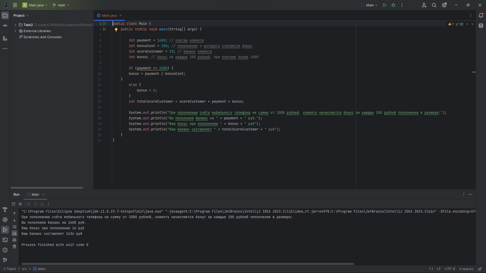

**<h2>Расчёт начисления бонусов при пополнении баланса мобильного телефона </h2>**

**<h3>Описание</h3>**
При пополнении счёта мобильного телефона свыше 1000 рублей клиенту начисляется по 1 бонусу за каждые 100 рублей.

**<h3>Шаги воспроизведения</h3>**

1. Открыть код программы в IDEA;
2. Выставить значение переменной payment (платеж клиента) равной 1 600;
3. Выставить значение переменной bonusCost (сумма на которую начисляются бонусы) равной 100;
4. Выставить значение переменной scoreCustomer (изначальный баланс клиента) равной 100;
5. Выставить значение переменной bonus (сумма бонуса за пополнение) 1 при условии пополнении больше или равной 1000;
6. Выставить значение переменной totalScoreCustomer (итоговый баланс клиента) равной сумме баланса клиента, совершаемого платежа и бонуса, начисляемого при платеже;
7. Запустить програму;
8. Посмотреть на вывод в консоли программы.

*Ожидаемый результат*: Вывод сообщения о пополнении баланса, количества бонусов и итоговый баланс клиента.

*Фактический результат*: Вывод сообщения о пополнении баланса, количества бонусов и итоговый баланс клиента

**<h3>Скриншот</h3>**

**<h3>Окружение</h3>**

- **Операционная система**: Windows 11
- **IDE** IntelliJ IDEA 2023.2 
- **Java**: OpenJDK 11